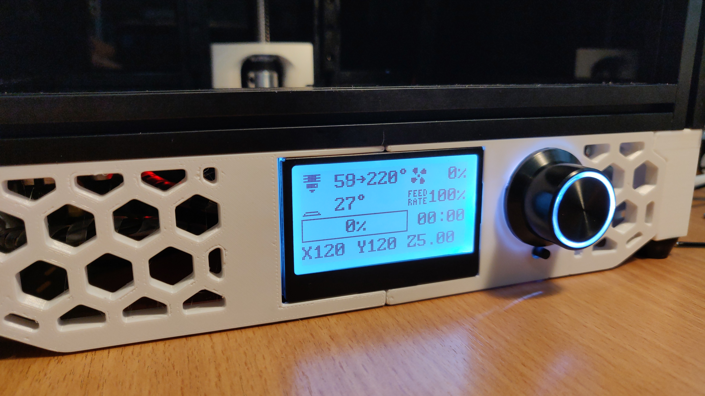
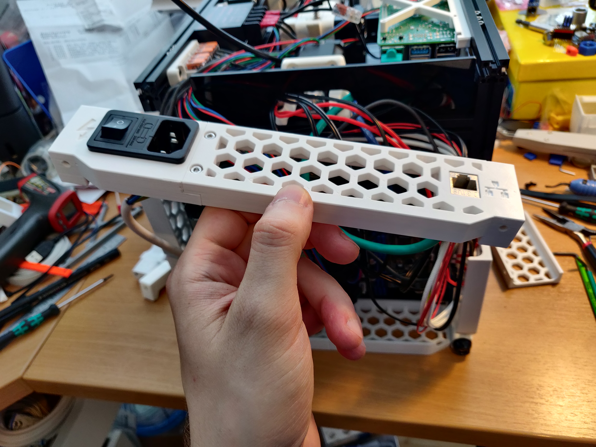
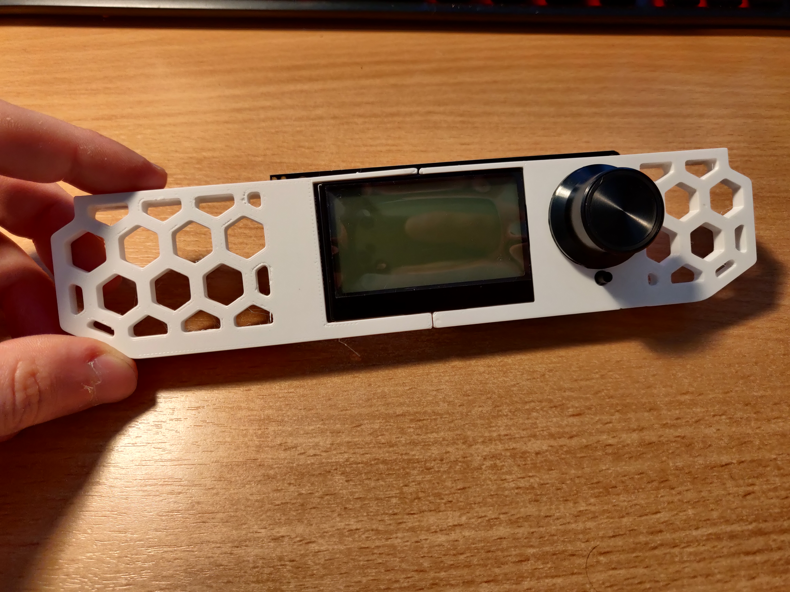

# High Skirts (38mm) 

Full set of side skirts, front feet, rear IO and front display. Used display is a Fysetc Mini 12864.
Display gets mounted using two heated inserts and a support part to isolate and hold the upper edge inside the 1515 extrusion.

