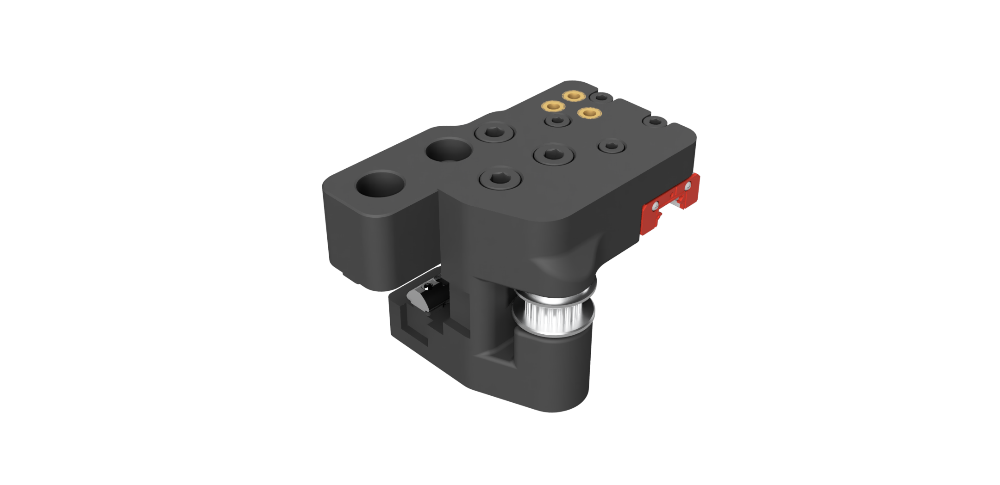

# Reenforced MGN12 XY Joints

The original Voron Design V1.8 XY Joints but with modification for single MGN12 like V2.4R2 or Trident. Additionally a second M5 hole for rigidity of the X extrusion was added like on V2.4R2 and Trident.

